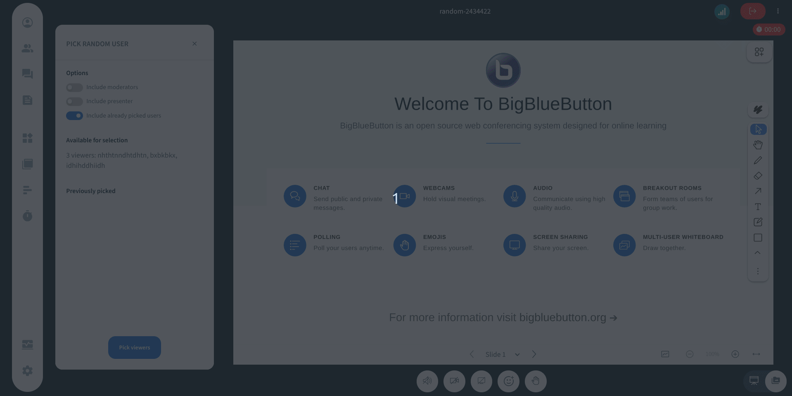

# Pick random user

## What is it?

The Pick Random User Plugin is listed in the apps gallery for presenters to pick a user randomly out of the whole list of users present in a meetings. 



## Building the Plugin

First, double check what branch of the repository you are working with. At time of writing branch `main` produces a version of the plugin that is suitable with BigBlueButton 3.0. Branch `v3.1.x-release` is compatible with BigBlueButton 3.1.

To build the plugin for production use, follow these steps:

```bash
cd $HOME/src/plugin-pick-random-user-plugin
npm ci
npm run build-bundle
```

The above command will generate the `dist` folder, containing the bundled JavaScript file named `PickRandomUserPlugin.js`. This file can be hosted on any HTTPS server along with its `manifest.json`.

If you install the Plugin separated to the manifest, remember to change the `javascriptEntrypointUrl` in the `manifest.json` to the correct endpoint.

To use the plugin in BigBlueButton, send this parameter along in create call:

```
pluginManifests=[{"url":"<your-domain>/path/to/manifest.json"}]
```

Or additionally, you can add this same configuration in `bbb-web`'s properties in `/etc/bigbluebutton/bbb-web.properties`


## Development mode

As for development mode (running this plugin from source), please, refer back to https://github.com/bigbluebutton/bigbluebutton-html-plugin-sdk section `Running the Plugin from Source`
